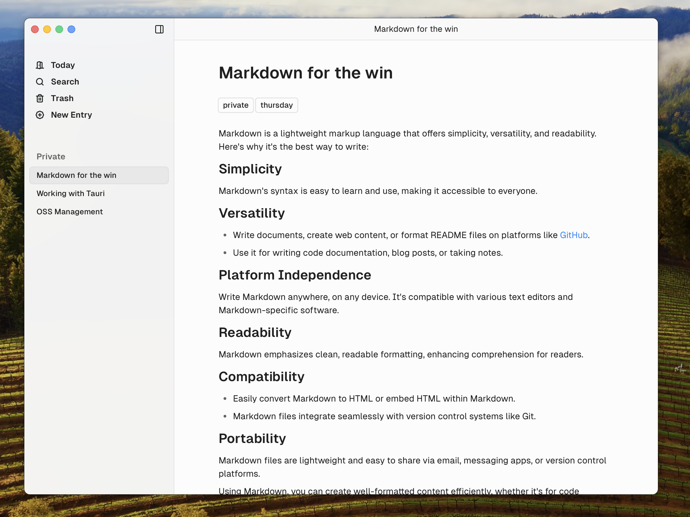

# Ibis

Ibis is a desktop app for writing and journaling in markdown. It allows you to organsize and tags your owns based on your own structure.

## Getting started

1. Download the latest version of Ibis on the [release page](https://github.com/sunday-studio/ibis/releases)
2. Open the `.zip` or `.dmg` file and drag the application into the `Applications/` folder.
3. Open the application, select a location for your `safe` and start writing.

## License

This project is licensed under the MIT License.
